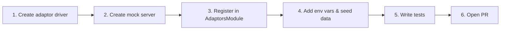

# Adding a Partner

> Step-by-step guide for integrating a new OTA / booking-engine partner.
> **Worked example**: Partner D (API-Key authentication, webhook-driven, inventory push).

[⬅ Back to README](../README.md) · [Architecture & Diagrams](ARCHITECTURE.md) · [Operations Runbook](RUNBOOK.md)

---

## Overview

Every partner integration requires four things:

1. **An adaptor driver** — implements the `PartnerAdaptor` interface.
2. **A mock server route** — simulates the partner's API for local development & E2E tests.
3. **Registration** — wire the adaptor into the module registry.
4. **Configuration** — environment variables, DB seed data and property mappings.



---

## Step 1 — Create the Adaptor Driver

Create a new file in `apps/api/src/modules/adaptors/drivers/`:

```
apps/api/src/modules/adaptors/drivers/partner-d.adaptor.ts
```

The adaptor must implement the `PartnerAdaptor` interface:

```ts
export interface PartnerAdaptor {
  readonly partnerSlug: string;
  readonly capabilities: PartnerCapabilities;

  verifyWebhook(
    headers: Record<string, string | string[]>,
    rawBody: Buffer | string,
  ): Promise<WebhookValidationResult>;

  transformInboundReservation(
    rawPayload: any,
  ): Promise<Omit<CanonicalReservationPayload, 'reservationId'>>;

  pushInventory(
    update: CanonicalInventoryPushPayload,
  ): Promise<{ success: boolean; partnerSyncId?: string }>;

  pullReservations(
    externalPropertyId: string,
    since?: Date,
  ): Promise<Array<Omit<CanonicalReservationPayload, 'reservationId'>>>;
}
```

### 1a. Declare the slug and capabilities

```ts
@Injectable()
export class PartnerDAdaptor implements PartnerAdaptor {
  readonly partnerSlug = 'partner_d';
  readonly capabilities: PartnerCapabilities = {
    webhooks: true,   // receives inbound webhooks
    polling: false,    // does NOT support polling
    inventoryPush: true, // supports outbound availability push
  };
```

> The `capabilities` flags tell the sync system which operations to attempt.
> - `webhooks: true` → the webhook controller will accept `POST /webhooks/partner_d`.
> - `inventoryPush: true` → the outbound sync processor will call `pushInventory()`.
> - `polling: true` → the polling processor will call `pullReservations()` on a schedule.

### 1b. Implement `verifyWebhook()`

Choose the authentication strategy your partner uses:

| Strategy | Example partner | Key methods |
|---|---|---|
| **API-Key** | Partner A, D | Compare `x-api-key` header with `PARTNER_D_API_KEY` using `safeCompare()`. |
| **OAuth2 Bearer** | Partner B | Validate bearer token against token endpoint. |
| **HMAC-SHA256** | Partner C | Compute HMAC over `rawBody` with shared secret, compare with signature header. |

Partner D uses API-Key:

```ts
async verifyWebhook(
  headers: Record<string, string | string[]>,
  rawBody: Buffer | string,
): Promise<WebhookValidationResult> {
  const apiKey = headers['x-api-key'] as string;

  if (!apiKey || !safeCompare(apiKey, this.expectedApiKey)) {
    return { isValid: false, error: 'Unauthorized: Invalid API key' };
  }

  const parsed = typeof rawBody === 'string'
    ? JSON.parse(rawBody)
    : JSON.parse(rawBody.toString('utf-8'));

  const idempotencyKey =
    headers['x-idempotency-key'] as string ||
    parsed.booking_reference ||
    parsed.booking_id;

  return {
    isValid: true,
    idempotencyKey: idempotencyKey ? `partner_d:${idempotencyKey}` : undefined,
    parsedBody: parsed,
  };
}
```

> **Important**: Always use `safeCompare()` (timing-safe) for secret comparisons to prevent timing attacks.

### 1c. Implement `transformInboundReservation()`

Map the partner's payload fields to the canonical reservation shape:

```ts
async transformInboundReservation(raw: any) {
  // Map partner-specific action verbs to canonical status
  let status: ReservationStatus = ReservationStatus.PENDING;
  const action = (raw.action || raw.status || '').toUpperCase();
  if (['BOOK', 'CONFIRM', 'CONFIRMED'].includes(action)) {
    status = ReservationStatus.CONFIRMED;
  } else if (['CANCEL', 'CANCELLED'].includes(action)) {
    status = ReservationStatus.CANCELLED;
  }

  return {
    externalBookingId: String(raw.booking_reference),
    propertyId: String(raw.internal_property_id),
    inventoryUnitCode: String(raw.room_type),
    checkInDate: String(raw.dates?.check_in),
    checkOutDate: String(raw.dates?.check_out),
    unitsBooked: Number(raw.units_count || 1),
    guestName: String(raw.customer?.name || 'Unknown Guest'),
    guestEmail: raw.customer?.email,
    totalPriceCents: Math.round(Number(raw.payment?.amount || 0) * 100),
    currency: raw.payment?.currency || 'USD',
    status,
    metadata: { originalSource: 'PartnerD_REST' },
  };
}
```

> The webhook controller validates the returned object against `CanonicalReservationSchema` (Zod) before passing it to the state machine. Any missing or malformed fields will be caught automatically.

### 1d. Implement `pushInventory()`

Map the canonical inventory payload to the partner's expected format and POST it:

```ts
async pushInventory(
  update: CanonicalInventoryPushPayload,
): Promise<{ success: boolean; partnerSyncId?: string }> {
  const res = await fetchWithTimeout(`${this.partnerBaseUrl}/inventory`, {
    method: 'POST',
    partnerSlug: this.partnerSlug,
    timeoutMs: 10000,
    headers: {
      'content-type': 'application/json',
      'x-api-key': this.expectedApiKey,
    },
    body: JSON.stringify({
      property_id: update.propertyId,
      unit_code: update.inventoryUnitCode,
      date: update.date,
      allotment: update.availableUnits,
      rate_cents: update.priceInCents,
    }),
  });

  if (!res.ok) {
    throw new Error(`Partner D inventory push failed with status ${res.status}`);
  }

  const data = await res.json();
  return { success: true, partnerSyncId: data.acknowledgementId };
}
```

### 1e. Implement `pullReservations()`

If the partner supports polling, fetch and normalise remote reservations. Otherwise, return an empty array:

```ts
async pullReservations(): Promise<Array<Omit<CanonicalReservationPayload, 'reservationId'>>> {
  return []; // Partner D is webhook-driven; polling not supported
}
```

---

## Step 2 — Create Mock Server Routes

Add a new directory under `apps/mock-partners/src/`:

```
apps/mock-partners/src/partner-d/
├── partner-d.controller.ts
└── partner-d.module.ts
```

The mock should accept the same `POST /partner-d/inventory` call your adaptor sends and return a plausible response:

```ts
@Controller('partner-d')
export class PartnerDController {
  @Post('inventory')
  handleInventoryPush(@Body() body: any) {
    return {
      acknowledgementId: randomUUID(),
      status: 'accepted',
    };
  }
}
```

Register the module in `apps/mock-partners/src/app.module.ts`.

---

## Step 3 — Register the Adaptor

Open `apps/api/src/modules/adaptors/adaptors.module.ts` and:

1. Import your new adaptor class.
2. Add it to `providers`.
3. Add it to the `ADAPTOR_REGISTRY` factory.
4. Add it to `exports`.

```diff
+ import { PartnerDAdaptor } from './drivers/partner-d.adaptor.js';

  @Module({
    providers: [
      PartnerAAdaptor,
      PartnerBAdaptor,
      PartnerCAdaptor,
+     PartnerDAdaptor,
      {
        provide: 'ADAPTOR_REGISTRY',
-       useFactory: (a, b, c) => {
+       useFactory: (a, b, c, d) => {
          const registry = new Map<string, PartnerAdaptor>();
          registry.set(a.partnerSlug, a);
          registry.set(b.partnerSlug, b);
          registry.set(c.partnerSlug, c);
+         registry.set(d.partnerSlug, d);
          return registry;
        },
-       inject: [PartnerAAdaptor, PartnerBAdaptor, PartnerCAdaptor],
+       inject: [PartnerAAdaptor, PartnerBAdaptor, PartnerCAdaptor, PartnerDAdaptor],
      },
    ],
-   exports: ['ADAPTOR_REGISTRY', PartnerAAdaptor, PartnerBAdaptor, PartnerCAdaptor],
+   exports: ['ADAPTOR_REGISTRY', PartnerAAdaptor, PartnerBAdaptor, PartnerCAdaptor, PartnerDAdaptor],
  })
```

---

## Step 4 — Configuration

### 4a. Environment variables

Add to `.env` and `.env.example`:

```env
PARTNER_D_API_KEY=cih_live_partner_d_key_112233
PARTNER_D_BASE_URL=http://localhost:4000/partner-d
```

Add validation rules to `apps/api/src/config/env.validation.ts`:

```ts
PARTNER_D_API_KEY: z.string().min(1).default('cih_live_partner_d_key_112233'),
PARTNER_D_BASE_URL: z.string().url().default('http://localhost:4000/partner-d'),
```

### 4b. Docker Compose

In `docker-compose.full.yml`, add the new env vars to the `api` service:

```yaml
PARTNER_D_API_KEY: ${PARTNER_D_API_KEY:-cih_live_partner_d_key_112233}
PARTNER_D_BASE_URL: http://mock-partners:4000/partner-d
```

### 4c. Seed data

Add a Partner record to `packages/database/prisma/seed.ts`:

```ts
await prisma.partner.upsert({
  where: { slug: 'partner_d' },
  update: {},
  create: {
    slug: 'partner_d',
    name: 'Partner D',
    authType: 'API_KEY',
    status: 'ACTIVE',
    apiKey: process.env.PARTNER_D_API_KEY || 'cih_live_partner_d_key_112233',
  },
});
```

Then create a `PropertyPartnerMapping` linking Partner D to a property and its external property ID.

### 4d. CI variables

If the CI workflow needs the secret, add it to `.github/workflows/ci.yml` in the E2E job's env block.

---

## Step 5 — Write Tests

### Unit test the adaptor

Create `apps/api/src/modules/adaptors/drivers/partner-d.adaptor.spec.ts`:

```ts
describe('PartnerDAdaptor', () => {
  describe('verifyWebhook', () => {
    it('accepts valid API key',           async () => { /* ... */ });
    it('rejects missing API key',         async () => { /* ... */ });
    it('rejects wrong API key',           async () => { /* ... */ });
    it('extracts idempotency key',        async () => { /* ... */ });
  });

  describe('transformInboundReservation', () => {
    it('maps BOOK action to CONFIRMED',   async () => { /* ... */ });
    it('maps CANCEL action to CANCELLED', async () => { /* ... */ });
    it('defaults to PENDING',             async () => { /* ... */ });
    it('calculates totalPriceCents',      async () => { /* ... */ });
  });

  describe('pushInventory', () => {
    it('sends correct payload shape',     async () => { /* ... */ });
    it('throws on non-OK response',       async () => { /* ... */ });
  });
});
```

### E2E test the webhook

In `apps/api/test/`, send a real HTTP request to `POST /webhooks/partner_d` with valid credentials and assert the reservation was created.

---

## Step 6 — Open a PR

Use the [PR template](../.github/pull_request_template.md) and ensure:

- [ ] All tests pass (`pnpm test && pnpm test:e2e`).
- [ ] Typecheck passes (`pnpm typecheck`).
- [ ] Code is formatted (`pnpm format:check`).
- [ ] `.env.example` is updated.
- [ ] Seed script creates the partner record.
- [ ] Mock partner server has matching routes.
- [ ] This guide is referenced in the PR description for reviewers.

---

## Checklist (copy into your PR)

```markdown
## New Partner Checklist

- [ ] Adaptor driver implements `PartnerAdaptor` interface
- [ ] `verifyWebhook()` uses timing-safe comparison
- [ ] `transformInboundReservation()` maps to canonical schema
- [ ] `pushInventory()` maps canonical → partner format
- [ ] `pullReservations()` implemented (or returns `[]` if polling unsupported)
- [ ] Mock server routes created in `apps/mock-partners/`
- [ ] Adaptor registered in `AdaptorsModule` (providers, factory, exports)
- [ ] Env vars added to `.env.example`, `env.validation.ts`, `docker-compose.full.yml`
- [ ] Partner seeded in `prisma/seed.ts` with `PropertyPartnerMapping`
- [ ] Unit tests written for all adaptor methods
- [ ] E2E test covers webhook → reservation flow
- [ ] CI env vars updated if needed
```

---

[⬅ Back to README](../README.md) · [Architecture & Diagrams](ARCHITECTURE.md) · [Operations Runbook](RUNBOOK.md)

