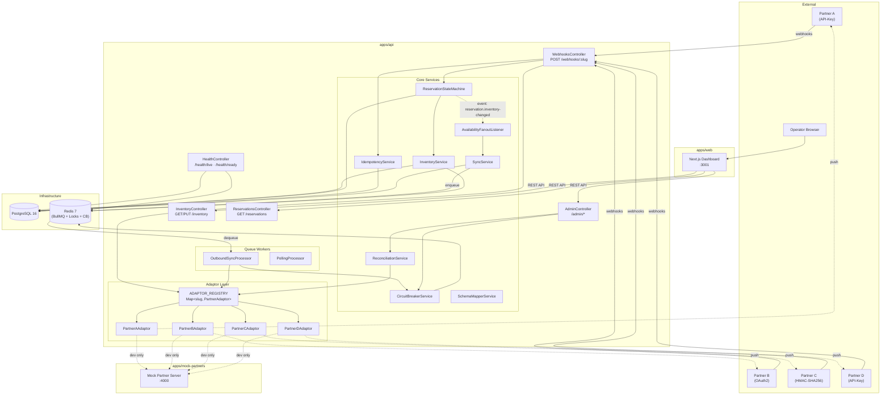
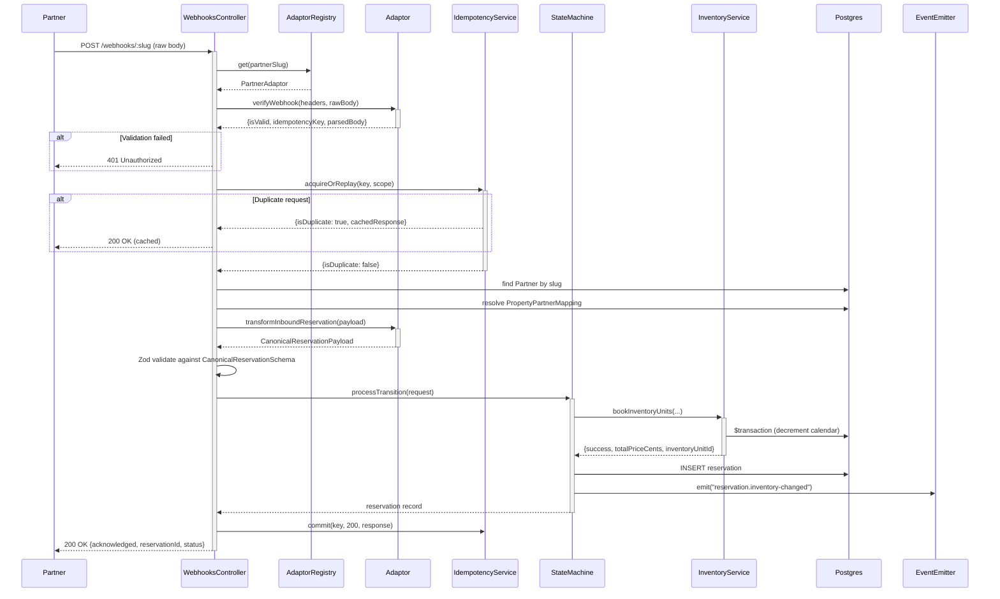
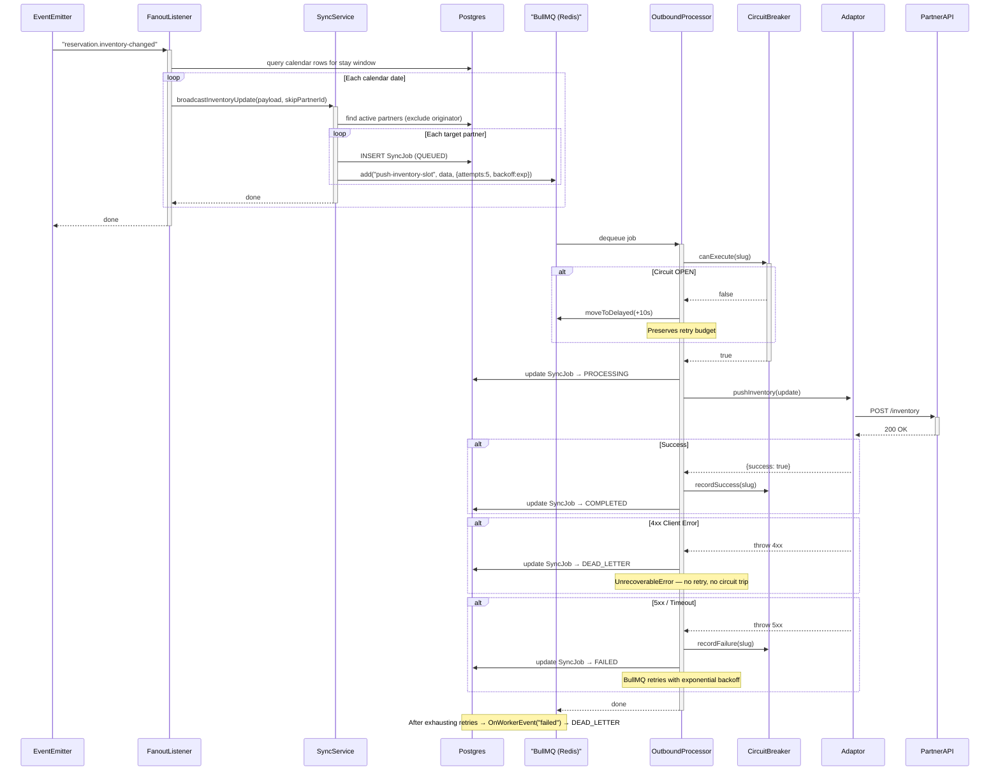
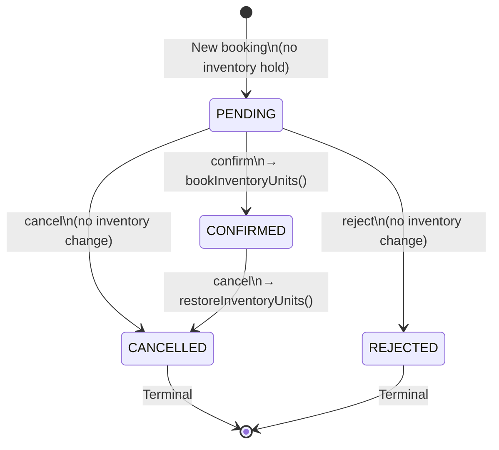
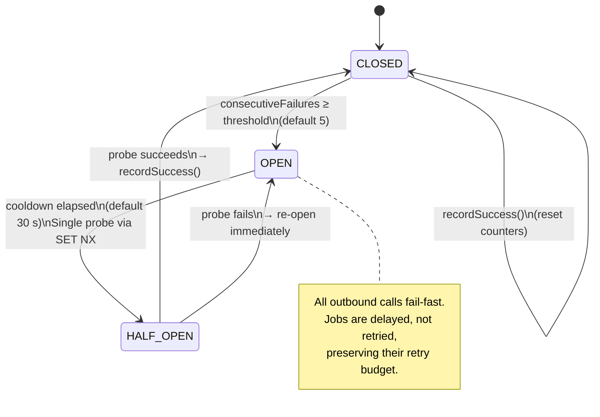
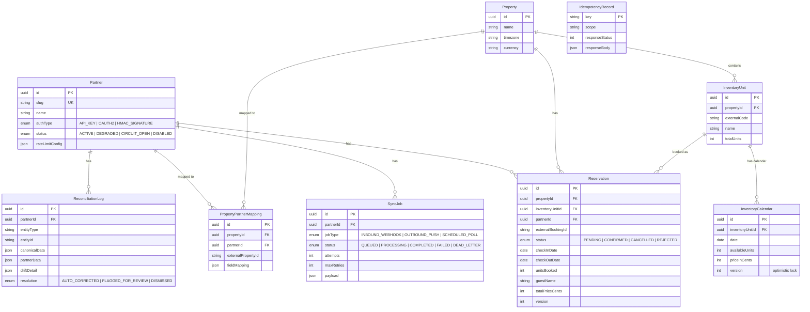

# Architecture

> Visual guide to the Channel Integration Hub internals.
> All diagrams use [Mermaid](https://mermaid.js.org/) — GitHub and most modern editors render them natively.

[⬅ Back to README](../README.md) · [Adding a Partner](ADDING_A_PARTNER.md) · [Operations Runbook](RUNBOOK.md)

---

## 1. Component View

High-level overview of the workspace packages and how they relate:

---

## 2. Webhook Ingestion Sequence

What happens when a partner sends a booking webhook:

---

## 3. Outbound Sync & Dead-Letter Queue Flow

After inventory changes, the fan-out pushes updates to every active partner:

---

## 4. Reservation State Machine

Valid transitions and their side-effects on inventory:

| From | To | Inventory Side-Effect |
|---|---|---|
| *(new)* | `PENDING` | None — no units reserved yet. |
| *(new)* | `CONFIRMED` | `bookInventoryUnits()` — decrements `availableUnits` across the stay window. |
| `PENDING` | `CONFIRMED` | `bookInventoryUnits()` — decrements calendar. |
| `PENDING` | `REJECTED` | None. |
| `PENDING` | `CANCELLED` | None. |
| `CONFIRMED` | `CANCELLED` | `restoreInventoryUnits()` — increments `availableUnits` back. |

> **Idempotency**: If a transition request targets the current state, the state machine returns the existing record without side-effects.

---

## 5. Circuit Breaker States

The per-partner circuit breaker prevents cascading failures when an external partner API is down:

**Redis keys per partner:**

| Key | Purpose |
|---|---|
| `circuit:<slug>:state` | Current state (`CLOSED` / `OPEN` / `HALF_OPEN`) |
| `circuit:<slug>:failures` | Consecutive failure counter |
| `circuit:<slug>:opened_at` | Timestamp when circuit tripped to OPEN |
| `circuit:<slug>:probe_lock` | Atomic `SET NX` lock for the single half-open probe |

**Operator override**: `POST /admin/partners/:slug/circuit/reset` force-resets the circuit to `CLOSED` and clears all counters.

---

## Data Model (ER Diagram)

---

[⬅ Back to README](../README.md) · [Adding a Partner](ADDING_A_PARTNER.md) · [Operations Runbook](RUNBOOK.md)

